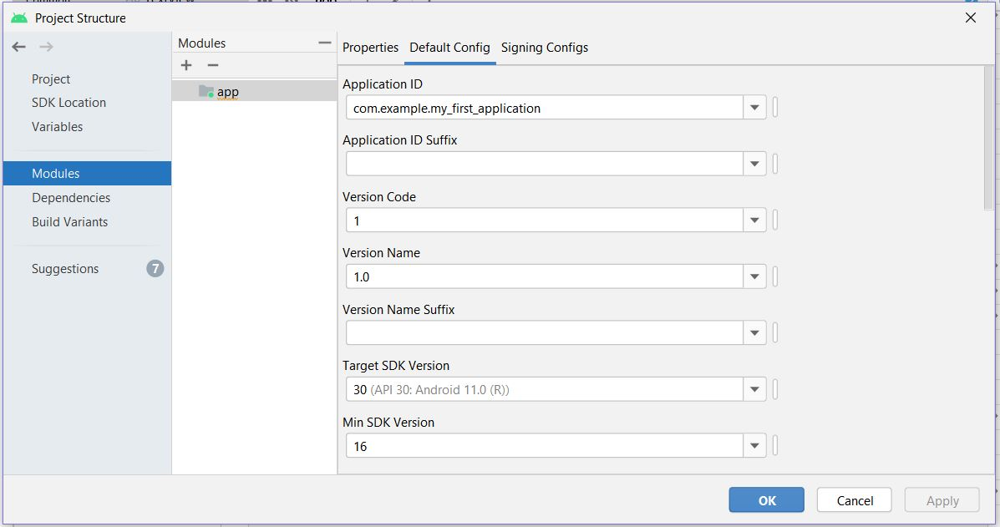

# SDK Error

### Error Quote: 
    "Installed Build Tools revision 31.0.0 is corrupted"

### Solving Steps

---

1. Go to "Project Structure"`
2. Click on "Modules"
3. Click on "Properties"
4. Click on "Build tools version"
5. 31.0.0 was selected by default, then I selected 28.0.3, this was only option available after 31.0.0. And it worked. But later I found 30.0.2 and selected.
6. Click on "Default Config"
7. "Target SDK Version" will be set same as "Compile SDK Version" of "Properties". Here I set both of them to 30. Previously I selected one as 28 and other as 30. It gave an error. But both 28 and 28 should work fine.
8. Apply and Ok.
9. This should be sufficient. If it doesn't work still, then make trial and error of the versions. I tried 28, 30, 31 etc.
---

### My Current Project Structure

